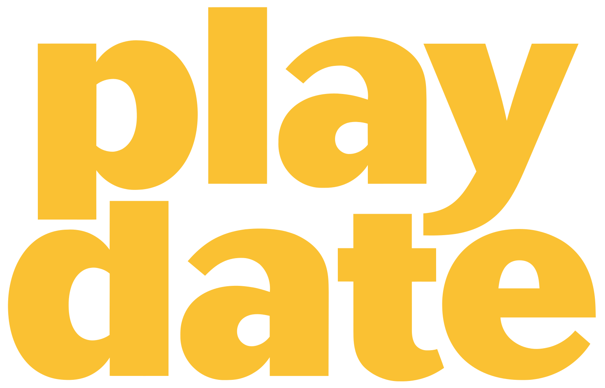

# PlaydateKit



Swift bindings to the [Playdate](https://play.date) C API.

Namespaces per subsystem, wrapper types that own their C objects, closures instead of function-pointer/userdata pairs, `OptionSet`s and `enum`s instead of raw constants, and typed `throws`. All ten C subsystems are covered:

| Namespace | Wraps | Highlights |
|---|---|---|
| `System` | `playdate->system` | input, time, menu items, logging |
| `Display` | `playdate->display` | refresh rate, scale, mosaic, flip |
| `Graphics` | `playdate->graphics` | drawing, `Bitmap`, `Font`, `TileMap`, video |
| `Sprite` | `playdate->sprite` | display list, collisions, custom draw |
| `Sound` | `playdate->sound` | players, synths, sequences, effects |
| `File` | `playdate->file` | `Handle`, directory operations |
| `JSON` | `playdate->json` | `Value` tree decode/encode |
| `Lua` | `playdate->lua` | C functions, classes, stack access |
| `Scoreboards` | `playdate->scoreboards` | online leaderboards |
| `Network` | `playdate->network` | wifi, `HTTPConnection`, `TCPConnection` |

## Requirements

- [Playdate SDK](https://play.date/dev/) 3.1.1+ (not bundled).
- Swift 6.4 tools.
- Any macOS. `InlineArray` overloads are `@available(macOS 26, *)` in Simulator builds; unrestricted on device and Linux.

Device builds also need:

- A [swift.org toolchain](https://www.swift.org/install/macos/) (6.4 release or a snapshot); Xcode's lacks the Embedded Swift stdlib. With [Swiftly](https://www.swift.org/swiftly/): `swiftly install main-snapshot`.
- The [Arm GNU toolchain](https://developer.arm.com/downloads/-/arm-gnu-toolchain-downloads) (`arm-none-eabi-gcc`) on your `PATH`.

### One-time SDK setup

`CPlaydate` finds `pd_api.h` through a `playdate` pkg-config module. Create it once per machine:

```sh
make setup
```

It reads `PLAYDATE_SDK_PATH` (default `~/Developer/PlaydateSDK`) and writes `/usr/local/lib/pkgconfig/playdate.pc`; pass another directory with `Scripts/install-pkgconfig.sh <directory>`. If Xcode had the package open, run File ▸ Packages ▸ Reset Package Caches.

## Adding the dependency

```swift
// Package.swift of your game
dependencies: [
    .package(
        url: "https://github.com/rock-n-code/playdate-kit.git", 
        from: "0.1.0"
    ),
],
targets: [
    .target(
        name: "MyGame",
        dependencies: [
            .product(
                name: "PlaydateKit", 
                package: "playdate-kit"
            )
        ]
    ),
]
```

## Getting started

A Playdate game has one C entry point, `eventHandler`. Export it with `@c`, call `Playdate.initialize(with:)` on the first event, and install an update callback:

```swift
import CPlaydate
import PlaydateKit

@c(eventHandler)
func eventHandler(
    pointer: UnsafeMutableRawPointer,
    event: PDSystemEvent,
    argument: UInt32
) -> Int32 {
    switch SystemEvent(event: event, argument: argument) {
    case .initialize:
        Playdate.initialize(with: pointer)   // must happen before anything else
        Game.shared.start()
    case .pause:
        Game.shared.pause()
    default:
        break
    }

    return 0
}

final class Game {
    nonisolated(unsafe) static let shared = Game()

    var player = Sprite()

    func start() {
        Display.refreshRate = 50

        System.setUpdateCallback {
            self.update()
            return true   // true = redraw the display this frame
        }
    }

    func pause() {
        System.log("paused")
    }

    func update() {
        let (_, pushed, _) = System.buttonState
        if pushed.contains(.a) {
            System.log("A pressed at \(System.currentTimeMilliseconds)ms")
        }

        Sprite.updateAndDrawAll()
        System.drawFPS()
    }
}
```

Calling any wrapper before `Playdate.initialize(with:)` crashes.

## Tour of the API

### System: input, time, menu

```swift
// Buttons: held now, pushed this frame, released this frame.
let (current, pushed, released) = System.buttonState
if current.contains([.b, .down]) { /* charge shot */ }

// Crank.
if !System.isCrankDocked {
    aim(degrees: System.crankAngle)
    spin(by: System.crankChange)
}

// Enable the accelerometer before reading it.
System.setPeripheralsEnabled(.accelerometer)
let (x, y, z) = System.accelerometer

// Menu items stay alive until removed.
System.addCheckmarkMenuItem(title: "music", isChecked: true) { item in
    Audio.musicEnabled = item.isChecked
}
System.addOptionsMenuItem(title: "mode", options: ["easy", "hard"]) { item in
    Game.shared.difficulty = item.value
}

// Logs go to the Simulator console or the device's serial port.
System.log("spawned \(count) enemies")
System.error("unrecoverable")   // stops the game
```

### Graphics: drawing, bitmaps, fonts

Loads (`Bitmap(path:)`, `Font(path:)`, …) throw `PlaydateError` with the OS's message:

```swift
let font = try Graphics.Font(path: "fonts/Asheville-Sans-14-Bold.pft")
Graphics.setFont(font)

Graphics.clear(color: .white)
Graphics.fillRect(x: 0, y: 0, width: 400, height: 32, color: .black)
Graphics.drawText("Hëllo, Playdate", x: 8, y: 8)

// Colors are solid or 8×8 patterns. On macOS 26+, the device, and Linux,
// `rows:` also takes an array literal.
let checker = Graphics.Pattern(rows: (0xAA, 0x55, 0xAA, 0x55,
                                      0xAA, 0x55, 0xAA, 0x55))
Graphics.fillEllipse(x: 100, y: 100, width: 64, height: 64,
                     color: .pattern(checker))

// Draw into a bitmap by pushing it as the drawing context.
let logo = try Graphics.Bitmap(path: "images/logo")
logo.draw(x: 168, y: 88)

let canvas = Graphics.Bitmap(width: 64, height: 64)
Graphics.pushContext(canvas)
Graphics.drawLine(x1: 0, y1: 0, x2: 63, y2: 63, width: 2, color: .black)
Graphics.popContext()
```

### Sprites and collisions

```swift
let ball = Sprite()
ball.setImage(try Graphics.Bitmap(path: "images/ball"))
ball.moveTo(x: 200, y: 120)
ball.collideRect = Rect(x: 0, y: 0, width: 16, height: 16)
ball.setCollisionResponseFunction { _, _ in .bounce }
ball.add()   // the display list keeps the sprite alive until it is removed

// In the update callback:
let (actual, collisions) = ball.moveWithCollisions(goalX: goalX, goalY: goalY)
for collision in collisions where collision.other.tag == Tags.brick {
    collision.other.remove()
}

// Collision and query APIs also have a visitor form that allocates no array:
ball.moveWithCollisions(goalX: goalX, goalY: goalY) { collision in
    if collision.other.tag == Tags.brick { collision.other.remove() }
}
```

The binding owns the C userdata slot; store your own per-sprite data in `Sprite.userdata`.

### Sound

```swift
// Stream from disk.
let music = try Sound.FilePlayer(path: "audio/theme")
music.play(repeat: 0)   // 0 = loop forever

// Play from memory.
let blip = try Sound.SamplePlayer(path: "audio/blip")
blip.play()

// Synthesis.
let synth = Sound.Synth(waveform: .square)
synth.setAttackTime(0.01)
synth.setReleaseTime(0.2)
synth.playMIDINote(Sound.noteC4, velocity: 0.8, length: 0.5)

// Channels mix sources and effects.
let channel = Sound.Channel()
channel.add()
channel.addSource(synth)
let filter = Sound.TwoPoleFilter(kind: .lowPass)
filter.setFrequency(800)
channel.addEffect(filter)

// Modulator properties accept any SignalValue (LFO, Envelope, …).
let wobble = Sound.LFO(shape: .sine)
wobble.setRate(2)
synth.frequencyModulator = wobble
```

### Files and JSON

```swift
// The open mode decides whether paths resolve in the Data directory or the pdx.
let save = try File.Handle(path: "save.json", mode: .write)
try save.write(JSON.encode(.table([
    "level": .int(3),
    "name": .string("Röck"),
])))
try save.close()

let loaded = try JSON.decodeFile(path: "save.json")
if case .table(let entries) = loaded, case .int(let level)? = entries["level"] {
    Game.shared.level = level
}

try File.listFiles(at: "replays") { name in
    System.log("found \(name)")
}
```

### Network

Each server needs the user's permission:

```swift
let reply = Network.HTTPConnection.requestAccess(
    server: "example.com", purpose: "Fetching daily puzzles") { allowed in
    guard allowed else { return }
    Puzzles.fetch()
}

func fetch() {
    guard let connection = Network.HTTPConnection(server: "example.com") else { return }
    connection.setRequestCompleteCallback { connection in
        let body = try? connection.read(length: connection.bytesAvailable)
        // Keep `connection` referenced until this callback fires.
    }
    try? connection.get(path: "/daily.json")
}
```

### Lua interop

Lua callbacks are C function pointers with no context, so they cannot capture:

```swift
let double: Lua.CFunction = { _ in
    Lua.push(Lua.intArgument(at: 1) * 2)
    return 1   // number of return values pushed
}
try Lua.addFunction(double, name: "mylib.double")
```

## Conventions

- **Namespaces.** Subsystems are top-level; only the bootstrap lives in `Playdate`. Qualify on a clash: `PlaydateKit.System`.
- **Properties vs. methods.** Readable state is a property; `set…` methods are write-only or take extra arguments. Callbacks: `set…Callback` / `set…Function`.
- **Paths.** `path:` for files, `at:` for directories; `File.stat`/`mkdir`/`unlink` are unlabeled like C.
- **Errors.** Typed throws: `PlaydateError`, or `Network.NetError` for network I/O.
- **Buffers.** `Span`/`MutableSpan`, valid only during the call. Mono audio gets an empty `right`.
- **Ownership.** Wrappers free what they create on `deinit` and retain what their C object references. Objects vended by the OS (a table's `Bitmap`, a `Sequence` track) need their owner alive. `File.Handle` is non-copyable and closes at end of scope or on `close()`.
- **Callbacks.** C callbacks without a userdata slot (serial, headphones, scoreboards, `getServerTime`) keep one closure at a time.
- **Threading.** Single-threaded except audio callbacks; don't call the API from other threads.

## Building for the simulator and device

Game logic builds and tests on the host with `swift build` / `swift test`. For a `.pdx`:

- **Simulator:** a host dylib inside the pdx; see `Examples/HelloPlaydate/build.sh`.
- **Device:** Embedded Swift for `armv7em-none-none-eabi` (`-fshort-enums`), linked by the SDK's make rules.

[`Examples/swift.mk`](Examples/swift.mk) runs the device pipeline; a game adds a short Makefile like [`Examples/HelloPlaydate/Makefile`](Examples/HelloPlaydate/Makefile), and `make` builds a `.pdx` with both binaries. Swift compiles `-Osize` (~15% smaller than `-O`); override with `make SWIFT_OPT=-O`. Adapted from Apple's [swift-playdate-examples](https://github.com/apple/swift-playdate-examples).

The library stays within Embedded Swift (no Foundation, reflection, or untyped throws). `make embedded` checks this by compiling the module for the device; it uses `~/Library/Developer/Toolchains/swift-latest.xctoolchain` unless `SWIFT_BIN=<path to swift>` is set.

## Make targets

`embedded` and `example*` need the device toolchains; the rest need only Xcode and `make setup`.

| Target | Effect |
|---|---|
| `make setup` | Point the `playdate` pkg-config module at the SDK (once per machine) |
| `make build` / `make test` | Build the bindings for the host / run the unit tests |
| `make outdated` / `make upgrade` | Show / apply updates to the SwiftPM dependencies |
| `make embedded` | Compile-only device check (Embedded Swift, `armv7em-none-none-eabi`) |
| `make consumer-test` | Build and run a scratch package depending on playdate-kit |
| `make check` | `build`, `test`, `embedded`, and `consumer-test` |
| `make docs` / `make docs-preview` | Generate / preview the DocC documentation |
| `make example` / `make example-run` | Build the HelloPlaydate example / open it in the Playdate Simulator |
| `make clean` | Remove build products of the package and the example |

## Example

[`Examples/HelloPlaydate`](Examples/HelloPlaydate): a bouncing box, crank needle, buttons, and a menu item.

```sh
cd Examples/HelloPlaydate

# Simulator only (SwiftPM, no extra toolchains):
./build.sh
open -a "$HOME/Developer/PlaydateSDK/bin/Playdate Simulator.app" HelloPlaydate.pdx

# Device and Simulator (swift.org toolchain and arm-none-eabi-gcc required):
make
```

Install on a device with Device ▸ Upload Game to Device in the Simulator, or `pdutil`.

## Documentation

DocC: `make docs`, `make docs-preview`, or Xcode's Product ▸ Build Documentation.

## Layout

```
Examples/
  swift.mk               Device build rules
  HelloPlaydate/         Example game
Scripts/
  install-pkgconfig.sh   Writes the playdate pkg-config module
  build-embedded.sh      Device compile check
  consumer-test.sh       Builds a package that depends on playdate-kit
Sources/
  CPlaydate/             pd_api.h module and log/error shims
  PlaydateKit/           Bindings: a folder per subsystem, a type per file, plus the DocC catalog
Tests/
  PlaydateKit/           Tests against a mock PlaydateAPI
```

## License

MIT ([LICENSE](LICENSE)). The Playdate SDK is licensed separately by Panic, Inc.
